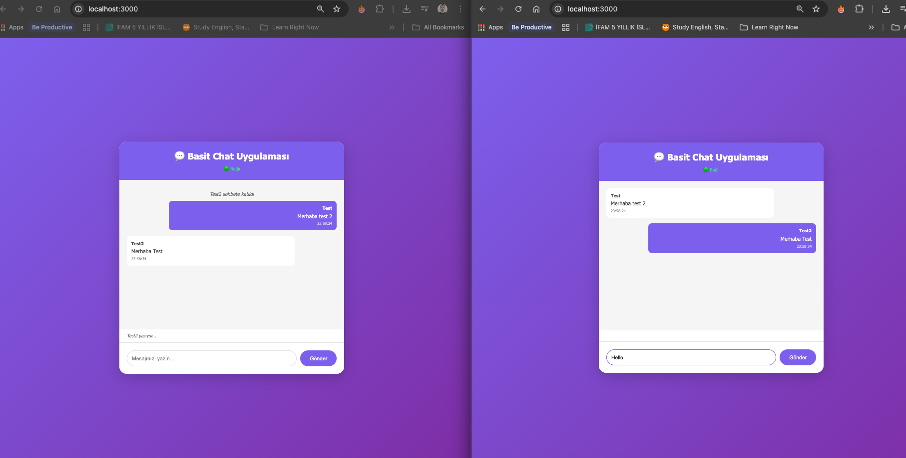

# 💬 Basit Chat Uygulaması - Socket.IO Öğrenme Projesi

Bu proje, Socket.IO kullanarak gerçek zamanlı mesajlaşmanın temel konseptlerini öğrenmek için hazırlanmış basit bir chat uygulamasıdır.

## 📁 Proje Yapısı

```
basit-chat-uygulamasi/
├── server.js           # Backend sunucu (Express + Socket.IO)
├── package.json        # Proje bağımlılıkları
└── public/
    └── index.html      # Frontend (HTML + CSS + JavaScript)
```

## 🚀 Kurulum ve Çalıştırma

### 1. Bağımlılıkları Yükle

Terminalde proje klasörüne git ve şu komutu çalıştır:

```bash
npm install
```

Bu komut `package.json` dosyasındaki `express` ve `socket.io` paketlerini indirecek.

### 2. Sunucuyu Başlat

```bash
npm start
```

veya

```bash
node server.js
```

Terminal şunu gösterecek:
```
🚀 Sunucu http://localhost:3000 adresinde çalışıyor
📝 Tarayıcıda iki sekme açıp chat'i test edebilirsin!
```

### 3. Tarayıcıda Test Et

1. Tarayıcını aç ve `http://localhost:3000` adresine git
2. Bir kullanıcı adı gir (örn: "Ali")
3. **Yeni bir sekme** aç ve yine `http://localhost:3000` adresine git
4. Farklı bir kullanıcı adı gir (örn: "Ayşe")
5. Artık iki sekme arasında mesajlaşabilirsin! 🎉

## 🔍 Nasıl Çalışıyor? - Adım Adım Açıklama

### Backend (server.js)

#### 1. Sunucu Kurulumu
```javascript
const express = require('express');
const http = require('http');
const socketIO = require('socket.io');

const app = express();
const server = http.createServer(app);
const io = socketIO(server);
```

- **Express**: Web sunucusu framework'ü
- **HTTP**: Express'i HTTP sunucusuyla sarmalıyoruz
- **Socket.IO**: Bu HTTP sunucusuna WebSocket yetenekleri ekliyoruz

#### 2. Static Dosya Sunumu
```javascript
app.use(express.static('public'));
```

`public` klasöründeki dosyaları (HTML, CSS, JS) doğrudan sunucudan erişilebilir yapıyor.

#### 3. Kullanıcı Takibi
```javascript
const users = new Map();
```

`Map` veri yapısı ile her bağlı kullanıcıyı takip ediyoruz:
- **Key**: Socket ID (her bağlantının benzersiz kimliği)
- **Value**: Kullanıcı adı

#### 4. Bağlantı Eventi (Connection)
```javascript
io.on('connection', (socket) => {
  console.log('Yeni bir kullanıcı bağlandı:', socket.id);
  // ...
});
```

Bir kullanıcı sayfayı açtığında bu event tetiklenir. `socket` parametresi o kullanıcının bağlantısını temsil eder.

#### 5. Kullanıcı Adı Ayarlama
```javascript
socket.on('set-username', (username) => {
  users.set(socket.id, username);
  
  // Diğerlerine bildir
  socket.broadcast.emit('user-connected', {
    username: username,
    message: `${username} sohbete katıldı`
  });
});
```

- `socket.on()`: Clienttan gelen eventi dinler
- `users.set()`: Kullanıcıyı Map'e ekler
- `socket.broadcast.emit()`: **Sadece diğer kullanıcılara** gönderir (gönderene değil)

#### 6. Mesaj Gönderme
```javascript
socket.on('send-message', (data) => {
  const message = {
    username: users.get(socket.id),
    text: data.text,
    timestamp: new Date().toLocaleTimeString('tr-TR')
  };
  
  // HERKESE gönder
  io.emit('receive-message', message);
});
```

- `users.get(socket.id)`: Gönderenin kullanıcı adını al
- `io.emit()`: **Tüm bağlı kullanıcılara** gönderir (gönderende dahil)

#### 7. Bağlantı Kopması
```javascript
socket.on('disconnect', () => {
  const username = users.get(socket.id);
  users.delete(socket.id);
  
  socket.broadcast.emit('user-disconnected', {
    username: username,
    message: `${username} sohbetten ayrıldı`
  });
});
```

Kullanıcı sekmeyi kapatınca veya internet kesilince otomatik tetiklenir.

### Frontend (public/index.html)

#### 1. Socket.IO Bağlantısı
```javascript
const socket = io();
```

Bu tek satır sunucuyla WebSocket bağlantısını kurar. Socket.IO otomatik olarak `http://localhost:3000` adresine bağlanır.

#### 2. Kullanıcı Adı Gönderme
```javascript
joinBtn.addEventListener('click', () => {
  const username = usernameInput.value.trim();
  socket.emit('set-username', username);
});
```

`socket.emit()`: Sunucuya event gönderir. İlk parametre event adı, ikincisi data.

#### 3. Mesaj Gönderme
```javascript
function sendMessage() {
  const text = messageInput.value.trim();
  socket.emit('send-message', { text });
}
```

#### 4. Mesaj Alma
```javascript
socket.on('receive-message', (message) => {
  displayMessage(message, message.username === currentUsername);
});
```

`socket.on()`: Sunucudan gelen eventi dinler.

#### 5. Bağlantı Durumu
```javascript
socket.on('connect', () => {
  connectionStatus.textContent = '🟢 Bağlı';
});

socket.on('disconnect', () => {
  connectionStatus.textContent = '🔴 Bağlantı Koptu';
});
```

Socket.IO'nun built-in eventleri. Bağlantı durumunu otomatik izler.

## 🎯 Önemli Kavramlar

### 1. Event-Based İletişim
Socket.IO event tabanlı çalışır:
- **emit**: Event gönder
- **on**: Event dinle

### 2. Broadcast vs Emit
- `socket.emit()`: Sadece o client'a gönderir
- `socket.broadcast.emit()`: O client HARİÇ herkese gönderir
- `io.emit()`: BÜTÜN clientlara gönderir (gönderende dahil)

### 3. Socket ID
Her bağlantının benzersiz bir ID'si vardır (`socket.id`). Bu ID ile kullanıcıları ayırt ederiz.

### 4. Otomatik Bağlantı Yönetimi
Socket.IO şunları otomatik yapar:
- Bağlantı koptuğunda yeniden bağlanmayı dener
- Heartbeat (ping/pong) ile bağlantıyı kontrol eder
- HTTP'den WebSocket'e otomatik upgrade yapar

## ✨ Eklenen Özellikler

1. **Kullanıcı Bildirimleri**: Birisi katıldığında/ayrıldığında sistem mesajı
2. **Yazıyor Göstergesi**: "Ali yazıyor..." mesajı
3. **Zaman Damgası**: Her mesajın gönderilme saati
4. **XSS Koruması**: Mesajlar HTML olarak değil text olarak gösteriliyor
5. **Bağlantı Durumu**: Canlı bağlantı göstergesi

## 🔧 Geliştirme İpuçları

### Hata Ayıklama
Terminalde logları görebilirsin:
```
Yeni bir kullanıcı bağlandı: xJq7sXc...
Ali chat'e katıldı
Ali mesaj gönderdi: Merhaba!
```

### Chrome DevTools
Tarayıcıda F12 basıp Network sekmesinde "WS" (WebSocket) filtresi ile Socket.IO trafiğini görebilirsin.

### Konsol Logları
Frontend console'da şunu yazarak socket objesini inceleyebilirsin:
```javascript
console.log(socket);
```

## 📚 Sonraki Adımlar

Bu temel projeyi öğrendikten sonra şunları ekleyebilirsin:

1. **Veritabanı**: MongoDB ile mesajları kalıcı sakla
2. **Kimlik Doğrulama**: JWT ile kullanıcı girişi
3. **Özel Mesajlar**: Sadece belirli bir kişiye mesaj gönderme
4. **Odalar**: Farklı chat odaları oluşturma
5. **Dosya Paylaşımı**: Resim ve dosya gönderme
6. **Mesaj Durumları**: İletildi, görüldü, okundu

## 🐛 Sorun Giderme

**Port zaten kullanılıyor hatası alıyorsan:**
- `server.js`'de `const PORT = 3000;` satırını `const PORT = 3001;` yap

**Socket bağlanamıyor:**
- Firewall'unuzu kontrol edin
- `localhost` yerine `127.0.0.1` deneyin

**npm install hata veriyor:**
- Node.js versiyonunuzu kontrol edin (en az v14 olmalı)
- `npm cache clean --force` komutunu deneyin

## 📖 Kaynak Kodda Öğrendiklerimiz

1. ✅ WebSocket bağlantısı nasıl kurulur
2. ✅ Event-based iletişim nasıl çalışır
3. ✅ Gerçek zamanlı mesaj gönderme/alma
4. ✅ Kullanıcı durumu takibi (bağlandı/ayrıldı)
5. ✅ Broadcast vs Emit farkı
6. ✅ Frontend-Backend senkronizasyonu

## 📝 Lisans

MIT - Özgürce kullanabilir, değiştirebilir ve paylaşabilirsin!

---

**İyi Kodlamalar! 🚀**

